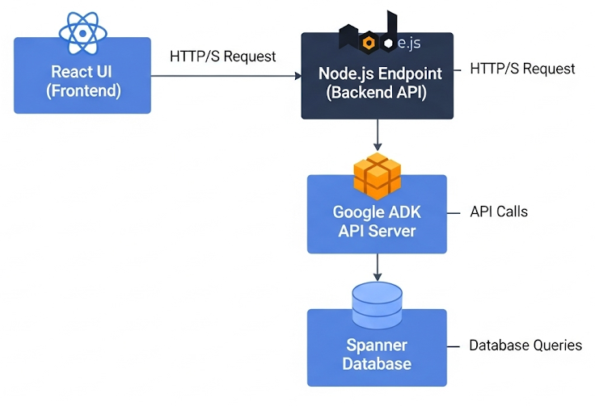
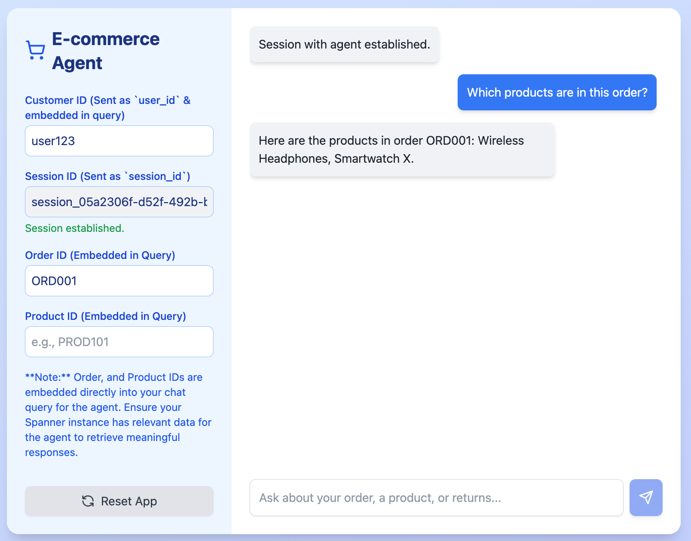

# E-commerce Chatbot with Spanner and Google ADK

This sample project demonstrates a chatbot built using the powerful integration between **Google Cloud Spanner** and the **Google Agent Development Kit (ADK)**. The application provides a simple web interface for customer service agents at an e-commerce company to quickly look up information about customer orders and products using natural language.

The goal is to showcase how to build a data-driven agent that can perform structured database queries based on conversational input, leveraging the global consistency and horizontal scalability of Spanner.

---

## 🏛️ Architecture

The application consists of two main components that work together to deliver the chat functionality.

*   **ADK API Server**: The core of the agent logic. It uses the Google ADK framework to interpret the natural language query, determine the user's intent, and use predefined **Tools** to query the Spanner database for the requested information.
*   **React UI**: A simple web interface where the customer service agent can type their questions (e.g., "What's the status of order #12345?").



### Data Flow 🌊

1.  A customer service agent enters a query into the **React UI**.
2.  The UI sends the query to the **ADK API Server**.
3.  The `root_agent` processes the user query. If the query is about order information, the `root_agent` will use the `nla_agent` to retrieve the information from the Spanner database.
4.  The `nla_agent` identifies the relevant Spanner tools (e.g., `spanner_execute_sql`) to use, and constructs a SQL query.
5.  The `nla_agent` executes the query against the **Cloud Spanner** database.
6.  Spanner returns the query results.
7.  The `nla_agent` formats the results and returns them to the `root_agent`.
8.  The `root_agent` formats the results into a human-readable response and sends it back through the chain to the UI.

---

## ✨ Key Features

*   **Order Lookup**: Get details for a specific order by providing an order ID.
*   **Product Search**: Find product information like price and stock levels by name or SKU.
*   **Status Check**: Check the shipping status of an order.
*   **Natural Language**: Interact with the database in plain English without writing SQL.

---

## 🛠️ Tech Stack

*   **Database**: Google Cloud Spanner
*   **Agent Framework**: Google Agent Development Kit (ADK)
*   **Frontend**: React

---

## 🚀 Getting Started

Follow these instructions to get the sample running in your own environment.

### Prerequisites

*   Python 3.11 or higher
*   Node.js (v18 or higher)
*   Google Cloud SDK (`gcloud` CLI) installed and authenticated
*   A Google Cloud project with the **Spanner API** enabled
*   An active Spanner instance and database

### Installation & Setup

1.  **Clone the repository:**
    ```bash
    git clone <YOUR_REPO_URL>
    cd <PROJECT_DIRECTORY>/customer_service_spanner_agent
    ```
2.  **Install dependencies for both the server and client:**
    ```bash
    # From the customer_service_spanner_agent folder, install adk and other python dependencies
    pip install google-adk
    pip install -r requirements.txt

    # Install client dependencies
    npm install
    ```
3.  **Set up the Spanner database:**
    *   Create your Spanner instance and database via the Google Cloud Console or `gcloud`.
    *   Apply the database schema located in `DDLs.sql` to your database.
    *   (Optional) Seed the database with sample data using the script in `mock_data.sql`.

4.  **Configure environment variables:**
    *   Create a `.env` file in the `customer_service_spanner_agent` folder and add your Spanner connection details:
    ```
    GOOGLE_CLOUD_PROJECT="<your-gcp-project-id>"
    GOOGLE_CLOUD_LOCATION="<your-gcp-region>" #e.g. us-central1
    GOOGLE_GENAI_USE_VERTEXAI="True"

    GCP_PROJECT_ID = "<your-gcp-project-id>"
    SPANNER_INSTANCE_ID = "<your-spanner-instance-id>"
    SPANNER_DATABASE_ID = "<your-spanner-db-id>"
    ```

### Running the Application

1.  **Start the ADK Server & Node.js Endpoint:**
    ```bash
    # Start the ADK api server from *customer-server-agent* folder
    adk api_server

    # This command will concurrently start the backend and frontend; do this from a different terminal window
    npm run start
    ```
2.  Open your browser and navigate to `http://localhost:3000` to start chatting!


