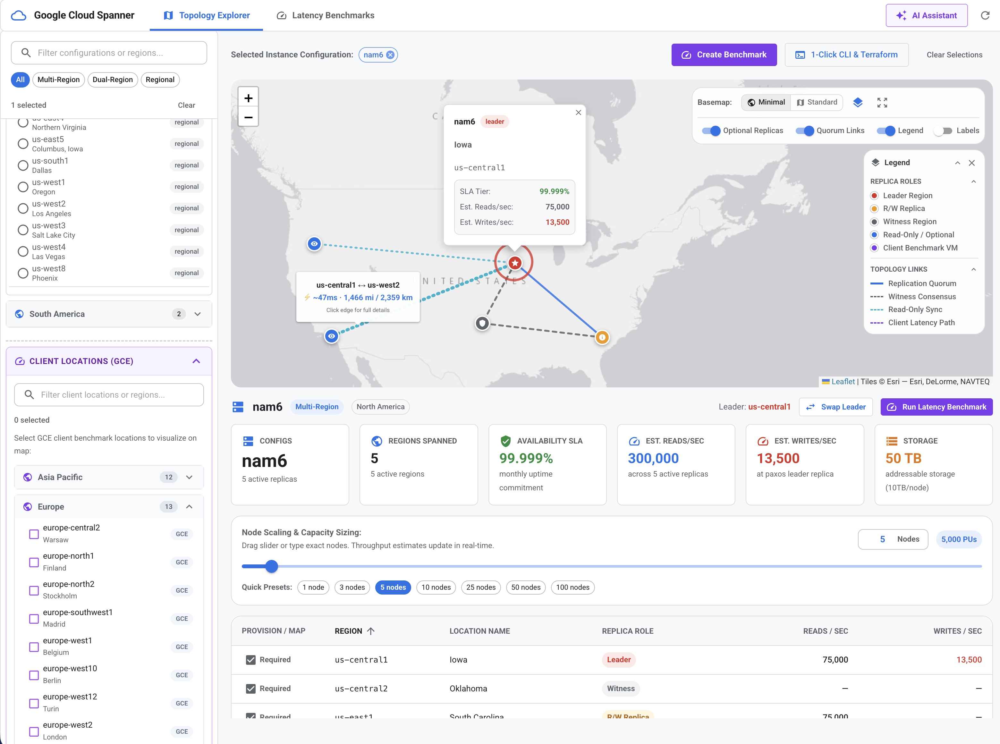

# Cloud Spanner Deployment Explorer

A tool for visualizing and benchmarking Google Cloud Spanner instance configurations and client latencies. Helps users to understand how Spanner configurations affect performance, and to design and execute benchmarks to validate their choices.




---

## Quickstart

The application can be run in one of three modes:

| Mode | `enable_load_testing` | `enable_ai` | Credentials Needed |
| :--- | :---: | :---: | :--- |
| **[1. Topology Explorer only](#1-topology-explorer-only)** | `false` | `false` | None |
| **[2. Topology Explorer + Benchmarking](#2-topology-explorer--benchmarking)** | `true` | `false` | `gcloud` + IAM Roles |
| **[3. Topology Explorer + Benchmarking + AI](#3-topology-explorer--benchmarking--ai)** | `true` | `true` | `gcloud` + IAM Roles + Gemini Key |

---

### 1. Topology Explorer only

Explore Cloud Spanner configurations, replica layouts, custom leaders, optional read replicas, QPS sizing calculations, and export CLI / Terraform commands.

#### Configuration (`config.json`)
Set `features` in `config.json`:
```json
{
  "features": {
    "enable_load_testing": false,
    "enable_ai": false
  }
}
```
*(Or launch with: `ENABLE_LOAD_TESTING=false ENABLE_AI=false ./run.py`)*

#### Requirements
- **Python 3.10+** (no GCP credentials or API keys needed)

#### Start
```bash
./run.py
```
Open **[http://127.0.0.1:8080](http://127.0.0.1:8080)**.

---

### 2. Topology Explorer + Benchmarking

Deploy live benchmark campaigns against Google Cloud. Provisions a Spanner instance (1 node) and client GCE runner VMs across selected regions to measure write, strong read, and stale read latencies. Deprovisions all resources automatically upon completion.

#### Configuration (`config.json`)
Set `features` in `config.json`:
```json
{
  "features": {
    "enable_load_testing": true,
    "enable_ai": false
  }
}
```
*(Or launch with: `ENABLE_AI=false ./run.py`)*

#### Requirements
- **Python 3.10+**
- **Google Cloud SDK (`gcloud`)** authenticated:
  ```bash
  gcloud auth application-default login
  ```
- **Enabled GCP APIs** on your target project:
  ```bash
  gcloud services enable \
    spanner.googleapis.com \
    compute.googleapis.com \
    storage.googleapis.com \
    serviceusage.googleapis.com \
    cloudresourcemanager.googleapis.com \
    --project=YOUR_PROJECT_ID
  ```
- **IAM Roles** on the target project:
  - `roles/spanner.admin` (create and delete test Spanner instance & database)
  - `roles/compute.instanceAdmin.v1` (create and delete client runner VMs)
  - `roles/storage.admin` (stage benchmark runner artifacts in GCS)

  ```bash
  for ROLE in roles/spanner.admin roles/compute.instanceAdmin.v1 roles/storage.admin; do
    gcloud projects add-iam-policy-binding YOUR_PROJECT_ID \
      --member="user:$(gcloud config get-value account)" \
      --role="$ROLE"
  done
  ```
- **Quotas**: Available quota for 1 Spanner node and 2 vCPUs (`e2-standard-2`) per client region.

#### Start
```bash
./run.py
```
Open **[http://127.0.0.1:8080](http://127.0.0.1:8080)**. When configuring a benchmark campaign, the built-in **Preflight Check** validates your credentials, project, APIs, and IAM permissions before launching.

---

### 3. Topology Explorer + Benchmarking + AI

Everything in Mode 2, plus an embedded Google Gemini AI Assistant for natural language sizing calculations, benchmark scenario preparation, and architecture Q&A.

#### Configuration (`config.json`)
Default settings in `config.json`:
```json
{
  "features": {
    "enable_load_testing": true,
    "enable_ai": true
  }
}
```

#### Requirements
- Everything from **Mode 2** (Python 3.10+, `gcloud`, GCP IAM roles)
- A **Gemini API Key** (available free from [Google AI Studio](https://aistudio.google.com/app/apikey))

#### Set the Key & Start
Provide the API key using any of the following methods, then run:

- **Option A (File)**: Save the key in `gemini.key` at the project root:
  ```bash
  echo "AIzaSy..." > gemini.key
  ./run.py
  ```
  *(Note: `gemini.key` is gitignored and will never be committed).*
- **Option B (Environment Variable)**:
  ```bash
  GEMINI_API_KEY="AIzaSy..." ./run.py
  ```
- **Option C (Web UI)**: Run `./run.py`, open the AI Assistant drawer in the web UI, click the Key icon, and paste your key.

---

## Configuration Reference

Application configuration is loaded from `config.json` at the root of the repository, with environment variable overrides supported.

### `config.json` Example

```json
{
  "features": {
    "enable_load_testing": true,
    "allow_dry_run": false,
    "allow_multiple_selections": false,
    "enable_edge_latency": true,
    "enable_ai": true
  },
  "load_testing": {
    "default_client_regions": [],
    "default_operations": 1000,
    "default_staleness_seconds": 15,
    "gce_machine_type": "e2-standard-2",
    "spanner_nodes": 1
  }
}
```

### Feature Flags (`features`)

| Setting | Type | Default | Env Variable | Description |
| :--- | :--- | :--- | :--- | :--- |
| `enable_load_testing` | `boolean` | `true` | `ENABLE_LOAD_TESTING` | Enables/disables the latency benchmarking pane and execution endpoints. Set to `false` to run strictly as a topology explorer. |
| `allow_dry_run` | `boolean` | `false` | `ALLOW_DRY_RUN` | Enables simulated physics-based benchmarking for local UI testing without GCP provisioning. |
| `allow_multiple_selections` | `boolean` | `false` | `ALLOW_MULTIPLE_SELECTIONS` | Enables selecting and comparing multiple Spanner configurations simultaneously on the map. |
| `enable_edge_latency` | `boolean` | `true` | `ENABLE_EDGE_LATENCY` | Renders edge latencies and distance metrics on topology connection lines. |
| `enable_ai` | `boolean` | `true` | `ENABLE_AI` | Enables the Spanner AI Assistant chat drawer and endpoints. |

### Benchmark Settings (`load_testing`)

| Setting | Type | Default | Env Variable | Description |
| :--- | :--- | :--- | :--- | :--- |
| `default_operations` | `integer` | `1000` | — | Default operations count per workload run (1–10,000). |
| `default_staleness_seconds` | `integer` | `15` | — | Staleness duration in seconds for stale read tests (1–3,600). |
| `gce_machine_type` | `string` | `"e2-standard-2"` | `LOAD_TESTING_GCE_MACHINE_TYPE` | GCE VM type for runner instances during live benchmarks. |
| `default_client_regions` | `string[]` | `[]` | — | Default GCE client regions pre-selected in new campaigns. |
| `spanner_nodes` | `integer` | `1` | — | Number of nodes provisioned for the benchmark instance (fixed at 1). |

### Server & AI Settings

| Variable | Default | Description |
| :--- | :--- | :--- |
| `HOST` | `127.0.0.1` | Network interface to bind the application server. |
| `PORT` | `8080` | Port on which the HTTP server listens. |
| `RELOAD` | `true` | Enables auto-reload on backend code changes (set to `false` in production). |
| `GEMINI_API_KEY` | *(None)* | Gemini API key for the AI Assistant. |
| `GEMINI_MODEL` | `gemini-3.8-flash` | Primary Gemini model for AI Assistant conversations. |

---

## Docker Usage

The project includes a multi-stage `Dockerfile` compiling the React frontend and packaging the FastAPI backend into a single container image.

### 1. Build Container Image

```bash
docker build -t dbexplorer-reloaded .
```

*(Alternatively: `./run.py --docker-build`)*

### 2. Run Container

```bash
docker run -p 8080:8080 dbexplorer-reloaded
```

Access the UI at [http://localhost:8080](http://localhost:8080).

---

## Deployment (Google App Engine Flex)

The application can be deployed to Google App Engine (GAE) Flexible environment.

> [!NOTE]
> When deployed to App Engine, the application runs in **Topology Explorer only** mode: live load testing and the AI Advisor are disabled by default (`ENABLE_LOAD_TESTING: "false"` and `ENABLE_AI: "false"` in `app.yaml`).

### 1. IAM Requirements for GAE Deployment
The App Engine default service account (`PROJECT_ID@appspot.gserviceaccount.com`) requires:
- **Artifact Registry Create-on-Push Writer**
- **Compute Admin**
- **Storage Admin** (or **Storage Owner** on the GAE staging bucket `gs://staging.PROJECT_ID.appspot.com`)

### 2. Deploying
Deploy using the automated helper script or `gcloud`:

```bash
./scripts/deploy_appengine.sh --project=YOUR_PROJECT_ID
```

*(Or: `gcloud app deploy app.yaml --project=YOUR_PROJECT_ID`)*

---

## License

Copyright 2026 Google LLC

Licensed under the Apache License, Version 2.0 (the "License");
you may not use this file except in compliance with the License.
You may obtain a copy of the License at

    http://www.apache.org/licenses/LICENSE-2.0

Unless required by applicable law or agreed to in writing, software
distributed under the License is distributed on an "AS IS" BASIS,
WITHOUT WARRANTIES OR CONDITIONS OF ANY KIND, either express or implied.
See the License for the specific language governing permissions and
limitations under the License.
