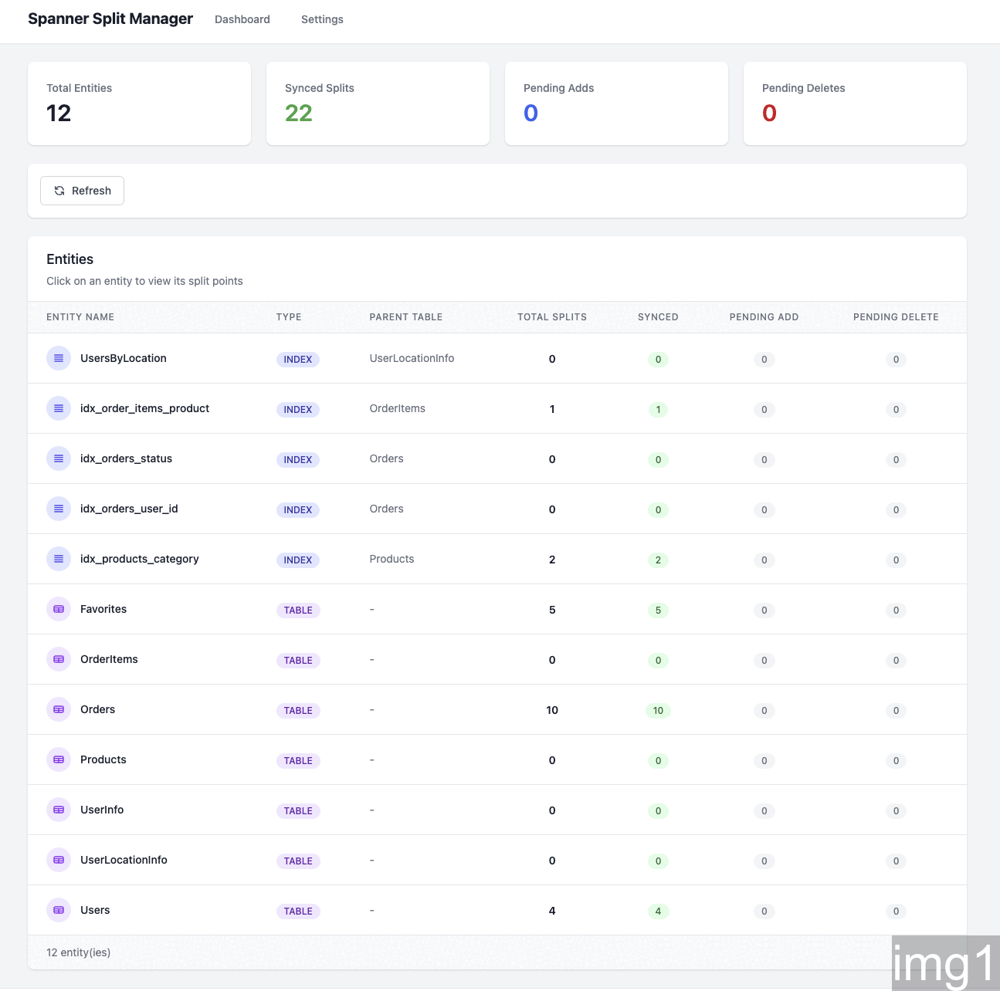

# Spanner Split Points Manager

> **Note:** This tool is not an official Google Cloud product. It is provided for illustration purposes only and should be used as a starting point for creating your own tooling.



A web application for managing Google Cloud Spanner split points with local staging.

## Features

- **Local Staging**: Stage split point changes locally before syncing to Spanner
- **Batch Sync**: Automatically batches changes to respect Spanner's 100 split points per request limit
- **Visual Status**: See which splits are synced, pending add, or pending delete
- **Safe Deletes**: Mark splits for deletion (sets immediate expiration) before syncing

## Tech Stack

- **Backend**: FastAPI (Python 3.10+)
- **Database**: SQLite (local staging)
- **Frontend**: Jinja2 templates + Alpine.js + TailwindCSS
- **Cloud**: Google Cloud Spanner SDK

## Setup

```bash
# Create virtual environment (or use conda)
python3 -m venv .venv
source .venv/bin/activate

# Install dependencies
pip install -r requirements.txt
```

## Configuration

### Option 1: Environment Variables

Create a `.env` file:

```env
PROJECT=your-gcp-project
SPANNER_INSTANCE=your-instance
SPANNER_DATABASE=your-database
```

### Option 2: Web UI Settings

Configure connection settings through the web interface at `/settings`.

### Authentication

Authenticate using Application Default Credentials:

```bash
gcloud auth application-default login
```

## Running the Application

```bash
# Development server with auto-reload
uvicorn main:app --reload

# Or specify host/port explicitly
uvicorn main:app --reload --host 0.0.0.0 --port 8000
```

Access the application at http://localhost:8000

### Running from VS Code Remote (SSH/Tunnels)

If you're developing on a remote machine via VS Code Remote SSH or a cloud VM:

1. Start the server in the VS Code integrated terminal:
   ```bash
   uvicorn main:app --reload --port 8000
   ```

2. VS Code automatically detects the port and offers to forward it. Look for a notification in the bottom-right corner, or:
   - Open the **Ports** panel (View > Open View > Ports, or click "Ports" in the bottom panel)
   - You'll see port 8000 listed
   - Click the globe icon or the forwarded address to open in your local browser

3. Alternatively, manually forward the port:
   - Open Command Palette (`Ctrl+Shift+P` / `Cmd+Shift+P`)
   - Run "Forward a Port"
   - Enter `8000`

The tunnel allows your local browser to access the web app running on the remote machine.

## Using the Web Interface

### Settings Page (`/settings`)

Before using the app, configure your Spanner connection. You have two options:

**Option 1: Environment Variables**

Set these environment variables (or create a `.env` file):
```bash
PROJECT=your-gcp-project
SPANNER_INSTANCE=your-instance
SPANNER_DATABASE=your-database
```

**Option 2: Web UI Settings**

1. Navigate to **Settings** in the navigation bar
2. Enter your **GCP Project ID**, **Spanner Instance**, and **Database** name
3. Click **Save Settings**
4. The app will validate the connection and show available tables

**Precedence**: Web UI settings take precedence over environment variables. If you configure settings via the UI, those values will be used even if environment variables are set. To revert to using environment variables, clear the values in the Settings page.

### Tables Page (`/tables`)

View and manage tables that have split points:

1. The page lists all tables/indexes with existing or staged split points
2. Click on a table name to view its split point details
3. Use **Refresh** to fetch the latest data from Spanner

### Split Points Detail Page

When viewing a specific table's split points:

1. **View existing splits**: Shows all split points with their current status
   - **Synced** (green): Exists in Spanner, no pending changes
   - **Pending Add** (yellow): Staged locally, will be added on sync
   - **Pending Delete** (red): Marked for deletion, will expire on sync

2. **Add new split points**:
   - Enter the split key value(s) in the input field
   - Click **Add Split** to stage it locally
   - The split appears with "Pending Add" status

3. **Delete split points**:
   - Click the **Delete** button next to any split
   - For synced splits, this marks them as "Pending Delete"
   - For pending adds, this removes them from local staging

4. **Sync to Spanner**:
   - Click **Sync** to push all pending changes to Spanner
   - Adds are sent as new split points
   - Deletes are sent with immediate expiration time
   - Changes are automatically batched (max 100 per request)

### Workflow Example

1. Configure connection in Settings
2. Navigate to Tables to see existing split points
3. Click a table to view/manage its splits
4. Add new splits or mark existing ones for deletion
5. Review pending changes (yellow/red status indicators)
6. Click Sync to apply all changes to Spanner
7. Refresh to verify the changes took effect

## API Endpoints

| Method | Endpoint | Description |
|--------|----------|-------------|
| GET | `/api/splits` | List all split points with status |
| POST | `/api/splits` | Add a new local split |
| DELETE | `/api/splits/{id}` | Remove a local split |
| POST | `/api/sync` | Sync pending changes to Spanner |
| GET | `/api/settings` | Get current settings |
| POST | `/api/settings` | Update settings |

## Architecture

```
User -> Web UI (Jinja2/Alpine.js)
     -> FastAPI API Routes (JSON)
     -> SQLite (local staging)
     -> Spanner Service (batched API calls)
     -> Google Cloud Spanner
```

Split points flow through three states:
- **SYNCED**: Exists in Spanner, no local changes
- **PENDING_ADD**: Staged locally, waiting to be sent to Spanner
- **PENDING_DELETE**: Exists in Spanner, marked for expiration locally
