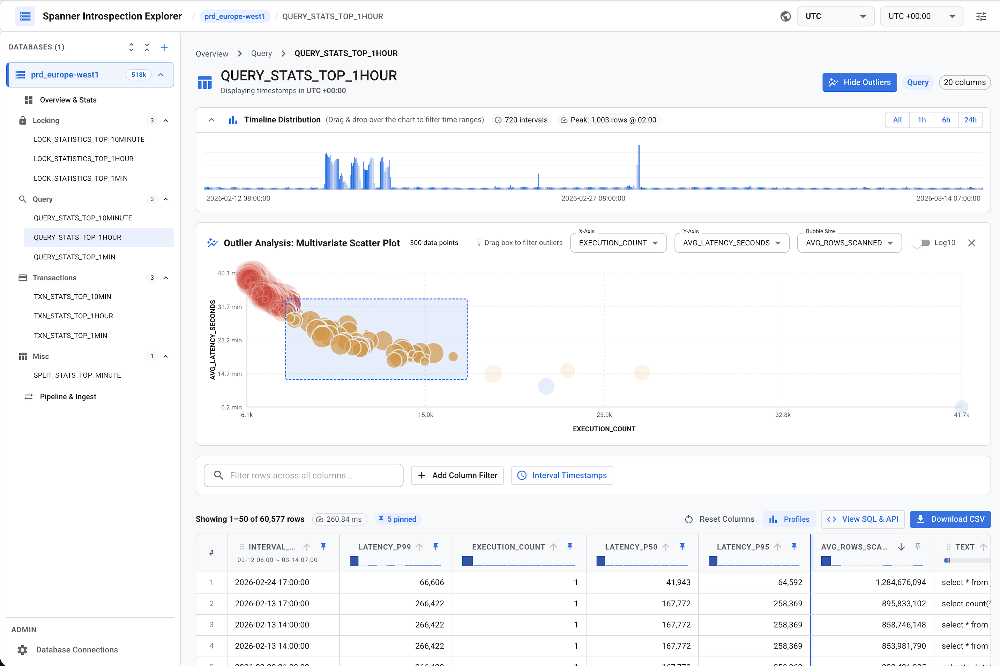

# Cloud Spanner Introspection Explorer

Connect to Cloud Spanner instances, load system [introspection tables](https://docs.cloud.google.com/spanner/docs/introspection) (query stats, transaction stats, lock statistics, split stats) into an embedded DuckDB database and explore metrics with an interactive web UI.

> ---
>  
> **Disclaimer**: This tool is provided "as-is" for development, testing and debugging purposes. Use at your own risk.
>  
> ---




---

## 1. Prerequisites

- Python 3.10+
- Node.js 18+ (for frontend development)
- Google Cloud SDK (`gcloud`) authenticated with permissions to access Cloud Spanner:

  ```bash
  gcloud auth login
  gcloud auth application-default login
  ```

---

## 2. Quick Start

```bash
# 1. Setup Python virtual environment
python3 -m venv .venv
source .venv/bin/activate
pip install -r requirements.txt

# 2. Start application (serves FastAPI backend & React SPA on port 8080)
python3 run.py
```

Open **http://localhost:8080** in your browser and create database connections.


## 4. Development & Testing

```bash
# Frontend development (hot reloading)
cd frontend
npm install
npm run dev      # Start Vite dev server with backend proxy
npm run build    # Build production bundle into backend/app/static/

# Run backend tests
PYTHONPATH=. .venv/bin/pytest backend/tests/ -v
``` 
